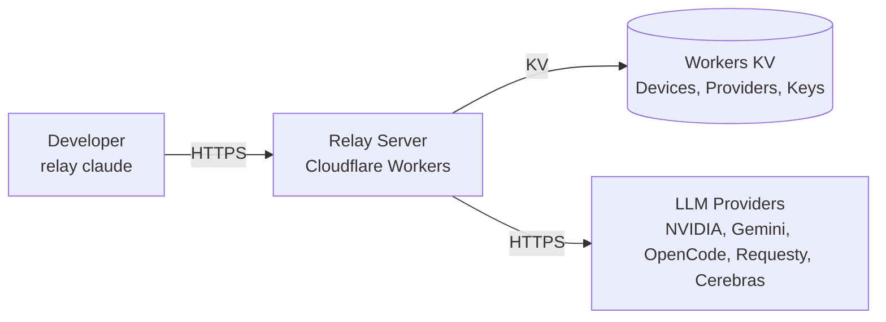

# Relay

Proxy Claude Code through your own choice of LLM providers — cloud-hosted server, multi-device via CLI.


---

## What is Relay

Relay lets you run Claude Code with any LLM provider you choose. A Cloudflare Worker proxies Anthropic Messages API requests to your configured providers (NVIDIA NIM, Google Gemini, OpenCode Zen, Requesty, Cerebras). The Python CLI handles device registration, token management, and provider configuration — all without a local daemon.

## Quick Start

### 1. Install

**macOS / Linux:**
```bash
curl -fsSL "https://raw.githubusercontent.com/<org>/relay/main/scripts/install.sh" | sh
```

**Windows (PowerShell):**
```powershell
& ([scriptblock]::Create((irm "https://raw.githubusercontent.com/<org>/relay/main/scripts/install.ps1")))
```

### 2. Configure

```bash
relay setup
# Enter your Relay server URL, device password, and device name
```

### 3. Run Claude Code

```bash
relay claude
# Inside Claude Code: /model shows live models from your providers
```

---

## How It Works



1. `relay setup` registers your device → returns a signed HMAC token (stored in keyring)
2. `relay claude` launches Claude Code with `ANTHROPIC_BASE_URL` pointing to your Relay server
3. Claude Code's `/model` picker calls `GET /v1/models` → Relay aggregates from all enabled providers
4. `POST /v1/messages` proxies through the matching provider transport (Anthropic or OpenAI)

---

## Supported Providers

| Provider | Transport | Base URL | API Key Env | Model Slug Prefix | Get Key |
|----------|-----------|----------|-------------|-------------------|---------|
| NVIDIA NIM | OpenAI | `https://integrate.api.nvidia.com/v1` | `NVIDIA_NIM_API_KEY` | `nvidia_nim/` | [NVIDIA](https://build.nvidia.com/) |
| Google AI Studio (Gemini) | OpenAI | `https://generativelanguage.googleapis.com/v1beta/openai/` | `GEMINI_API_KEY` | `gemini/` | [Google AI Studio](https://aistudio.google.com/) |
| OpenCode Zen | OpenAI | `https://opencode.ai/zen/v1` | `OPENCODE_API_KEY` | `opencode/` | [OpenCode](https://opencode.ai/) |
| Requesty | Anthropic | `https://router.requesty.ai/v1` | `REQUESTY_API_KEY` | `requesty/` | [Requesty](https://requesty.ai/) |
| Cerebras | OpenAI | `https://api.cerebras.ai/v1` | `CEREBRAS_API_KEY` | `cerebras/` | [Cerebras](https://cerebras.ai/) |

---

## Client Commands

```bash
# Initial configuration (one-time per device)
relay setup --server-url https://your-worker.workers.dev --password <device-password> --device-name "laptop"

# Launch Claude Code with Relay
relay claude
relay claude -- --help          # pass args to claude

# Provider management (admin-gated)
relay provider add nvidia_nim --key <key> --admin-password <admin-password>
relay provider add-custom custom --base-url https://api.example.com --key <key> --schema openai --admin-password <admin-password>
relay provider list --admin-password <admin-password>
relay provider remove nvidia_nim --admin-password <admin-password>
```

---

## Server Deployment

### Prerequisites
- Cloudflare account (free tier)
- `wrangler` CLI: `npm i -g wrangler`

### Deploy

```bash
cd server
npm install
wrangler login

# Create KV namespace
wrangler kv:namespace create RELAY_KV
# Update wrangler.toml with the returned IDs

# Set secrets (never committed)
wrangler secret put RELAY_PASSWORD      # shared device password
wrangler secret put RELAY_ADMIN_PASSWORD # separate admin password

# Deploy
wrangler deploy
```

### Configuration

`wrangler.toml`:
```toml
name = "relay-server"
main = "src/index.ts"
compatibility_date = "2024-08-01"
compatibility_flags = ["nodejs_compat"]

[[kv_namespaces]]
binding = "RELAY_KV"
id = "<your-kv-id>"
preview_id = "<your-preview-kv-id>"
```

---

## Uninstalling

**macOS / Linux:**
```bash
curl -fsSL "https://raw.githubusercontent.com/<org>/relay/main/scripts/uninstall.sh" | sh
```

**Windows (PowerShell):**
```powershell
& ([scriptblock]::Create((irm "https://raw.githubusercontent.com/<org>/relay/main/scripts/uninstall.ps1")))
```

Removes only `~/.relay/` and the `uv tool`-installed `relay-cli`. Does **not** touch `uv`, Python, or Claude Code.

---

## Security Notes

- **Passwords**: PBKDF2-SHA256 (100,000 iterations), unique salt per password, never stored plaintext
- **Device tokens**: HMAC-SHA256 over `device_uuid.issued_at`, verified server-side, revocable
- **Provider keys**: Written via admin routes, stored in KV, never returned by GET routes, masked in lists
- **Admin actions**: Separate admin password → short-lived admin token (distinct KV prefix from device tokens)
- **No secrets in logs**: Tokens, keys, passwords, hashes never logged — only device UUIDs and request metadata

---

## Development

### Project Structure

```
relay/
├── server/                 # Cloudflare Worker (TypeScript)
│   ├── src/
│   │   ├── routes/         # HTTP endpoints
│   │   ├── core/           # SSE, thinking, tools, usage
│   │   ├── providers/      # Transports, catalog, router
│   │   ├── auth/           # Password hashing, tokens
│   │   └── kv.ts           # Typed KV helpers
│   ├── test/               # vitest
│   └── wrangler.toml
├── client/                 # Python CLI (uv)
│   ├── src/relay_cli/      # setup, claude, provider, config, crypto
│   ├── tests/              # pytest
│   └── pyproject.toml
├── scripts/                # install.sh, install.ps1, uninstall.sh, uninstall.ps1
├── docs/
│   └── ARCHITECTURE.md
└── README.md
```

### Run Tests

```bash
# Server
cd server && npm test && npm run typecheck && npm run lint

# Client
cd client && python -m pytest tests/ -v && python -m ruff check .
```

### Local Development

```bash
# Server (with Miniflare)
cd server && npx wrangler dev --port 8787

# Client (editable install)
cd client && pip install -e ".[dev]"
```

---

## License

[MIT](LICENSE)